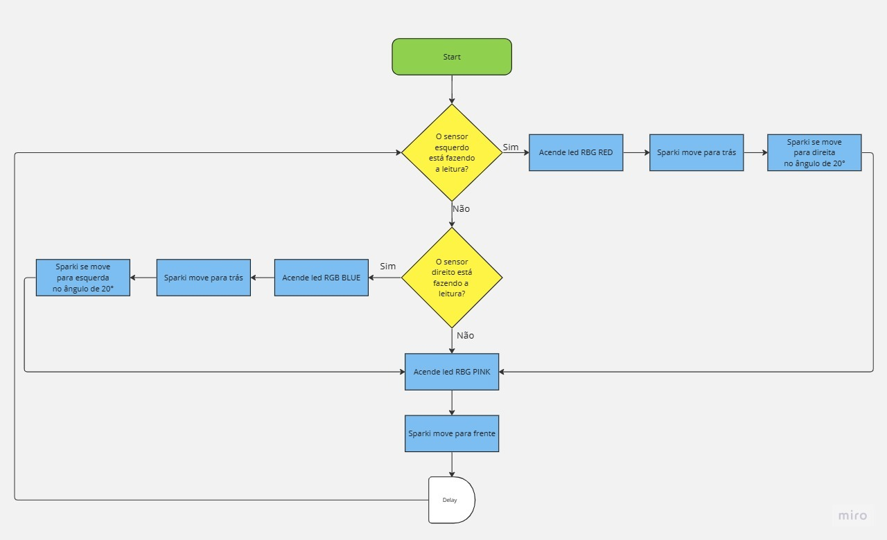

# Projeto 1 - Evitar borda, Não cair <h1>

## Descrição

Esse código é uma demosntração de como o Sparki, pode evitar quedas ao detectar as bordas de uma superficie. Ele utliza dois sensores infravermelhos para medir 
a proximidade das bordas esquerda e direita. 

O codigo consite que o Sparki que realize algumas ações: 

1- Medir a proximidade da borda esquerda usando o sensor IR esquerdo.
2- Se a proximidade for menor que um determinado limite (threshold = 200), indicando que não há superfície abaixo do sensor, o Sparki acende o LED RGB na cor vermelha, recua uma distância pré-definida e vira à direita em um ângulo também pré-definido.
3- Em seguida, o Sparki mede a proximidade da borda direita usando o sensor IR direito.
4- Se a proximidade for menor que o limite estabelecido, indicando a ausência de superfície abaixo do sensor direito, o Sparki acende o LED RGB na cor azul, recua a mesma distância e vira à esquerda no mesmo ângulo.
5- Se não houver detecção de bordas em ambos os sensores, o LED RGB acende na cor rosa e o Sparki segue em frente.
6- O código inclui um pequeno atraso  de 0.1 segundos entre cada iteração do loop.

## Video

  [vídeo do robô executando](https://youtu.be/We9_DYo-2kw)

  ## Fluxograma
  
 Para melhor visualização das etapas que o Sparki deve realizar, o fluxograma abaixo exemplifica a sequencia e as decisões na qual devem ser seguidas de maneira linear . É inicializado no Void loop com a primeira condição de IF, que representa a leitura do sensor esquerdo, caso tenha detectado algo instantaneamente é ligado o led RGB RED, em seguida o Sparki move para trás e se redireciona para ir a direita em um angulo de 20°
O mesmo processo de repete para segunda condição de IF, onde é realizado a leitura para o sensor direito, quando detectado é ligado led RGB BLUE, logo o Sparki move para trás e se redireciona para ir a esquerda no angulo de 20°.
Em um ultimo caso, quando nenhuma condição IF é verdadeira o Sparki é direcionado a continar seguindo em frente enquanto não houver uma leitura detectada, por isso temos um loop e delay para que haja um tempo de leitura antes da ação depois q ele vira o 20° coloca isso:
o sparki é programado a seguir em frente até que haja uma nova analise dos sensores
    
   
  

